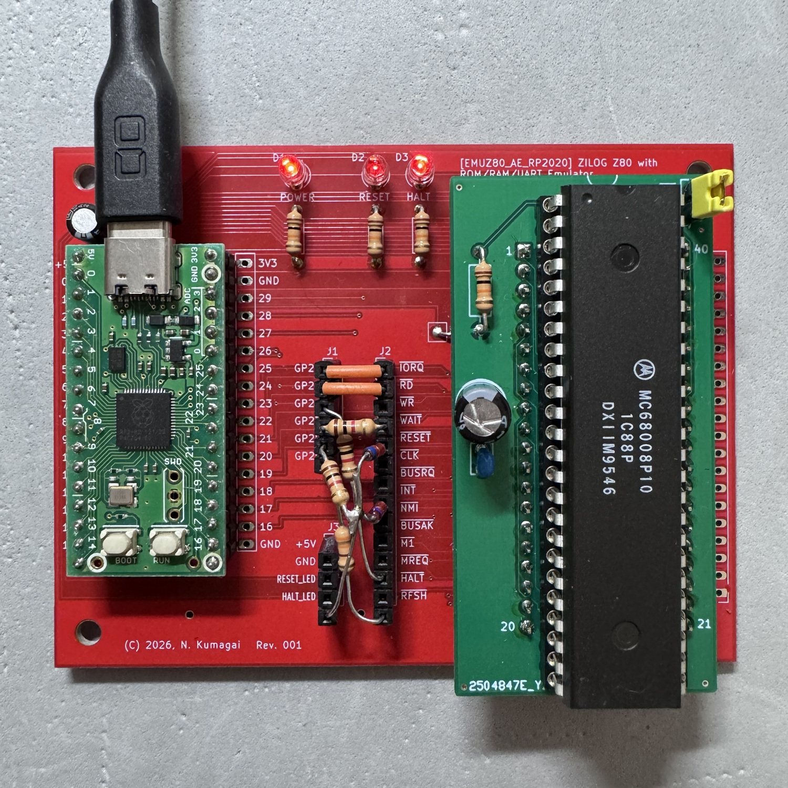
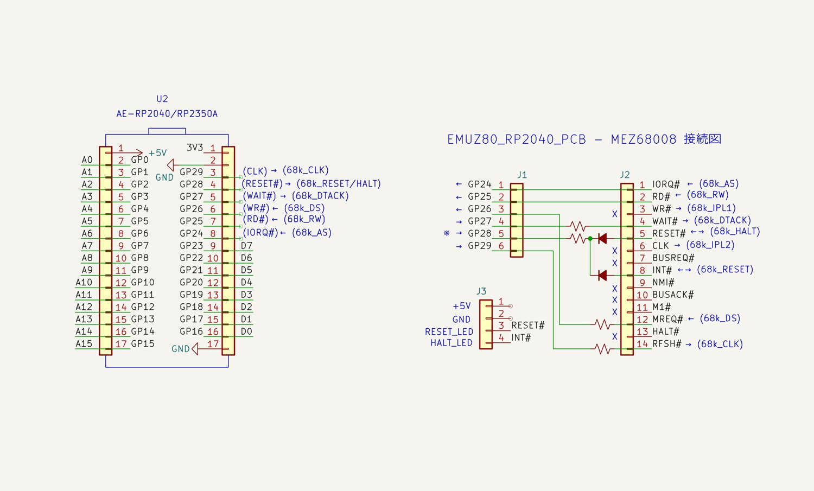
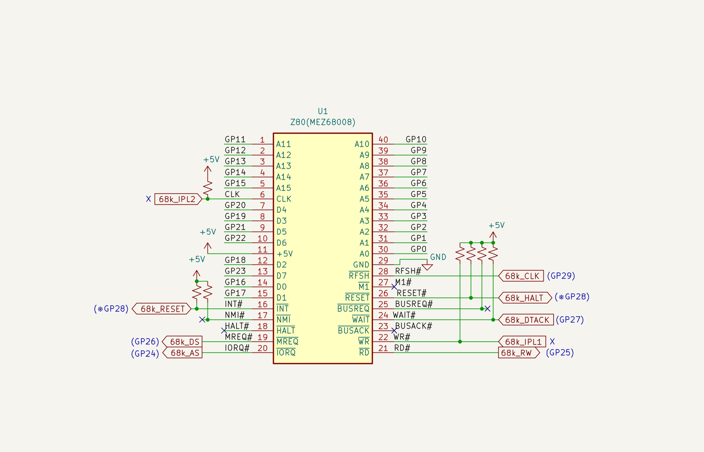
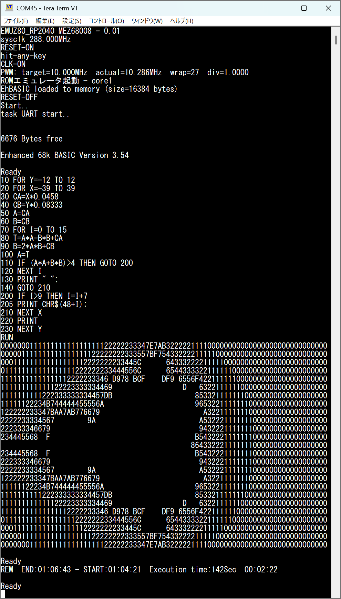

# EMUZ80_RP2040_PCB_MEZ68008_Firmware



@tendai22plus さんの **EMUZ80_RP2040_PCB** と @S_Okue さんの **MEZ68008** を使って、Z80 DIP40の信号を組み替え MC68008 を動作させることができます。

作者: DragonBallEZ

## 概要

秋月電子通商 AE-RP2040で MC68008が動作する EMUZ80_RP2040_PCB用のファームウェアです。

- RP2040 が 64KB RAM と MC6850 互換 ACIA (0xE000/0xE001) をエミュレート
- RP2040 デュアルコア + 直接 SIO アクセスによる高速バスエミュレーション
- USB CDC (stdio_usb) 経由でシリアルをブリッジ
- EhBASIC (Enhanced 68k BASIC v3.54) を標準搭載
- システムクロック 過電圧オーバークロック対応（デフォルト 288MHz）
- PWM による CPU クロック出力（デフォルト 10MHz）

## 対象ハードウェア

- 秋月電子通商 AE-RP2040
- @tendai22plus さん作 EMUZ80_RP2040_PCB
- @S_Okue さん作 MEZ68008 (MC68008 用アダプタ)

## ピン割り当て

| GPIO | 信号   | 方向     | 説明                     |
|------|--------|----------|--------------------------|
| 0-15 | A0-A15 | IN       | アドレスバス             |
| 16-23| D0-D7  | IN/OUT   | データバス               |
| 24   | AS     | IN       | Address Strobe           |
| 25   | R/W    | IN       | Read/Write               |
| 26   | DS     | IN       | Data Strobe              |
| 27   | DTACK  | OUT      | Data Transfer Acknowledge|
| 28   | RESET  | OUT (OD) | リセット                 |
| 29   | CLK    | OUT (PWM)| 68008 用クロック         |

## 回路図



## ビルド方法

### 必要環境
- Raspberry Pi Pico SDK (2.2.0 推奨)
- CMake + Ninja または Make
- ARM GCC ツールチェイン

### ビルド手順 (例: Windows + VS Code + Pico Extension)

```powershell
# このディレクトリで
mkdir build
cd build
cmake ..
ninja   # または make
```

ビルド成果物:
- `EMUZ80_RP2040_PCB_MEZ68008_Firmware.uf2`
- `.hex`, `.bin`, `.elf` なども生成されます

ボードの BOOTSEL ボタンを押しながら USB 接続 → UF2 をドロップして書き込み。

## 使い方

1. ファームウェアを書き込む
2. USB シリアルでターミナル接続（例: Tera Term, PuTTY, minicom）
3. 任意のキーを押してブート
4. EhBASIC が起動します

**終了方法**: `Ctrl + \` (0x1C) を送信

### 設定変更（上級者向け）
`EMUZ80_RP2040_PCB_MEZ68008_Firmware.c` 冒頭の
```c
#define TARGET_SYS_CLK_KHZ 288000
```
と
```c
float desired_freq = 10000000.0f;    // CLK周波数
```
を編集して再ビルド。

## 実行例



## ファイル構成

- `EMUZ80_RP2040_PCB_MEZ68008_Firmware.c` - メイン（C言語版 / 推奨）
- `EMUZ80_RP2040_PCB_MEZ68008_Firmware.py` - MicroPython 参考実装
- `ehbasic.c` / `ehbasic.h` - EhBASIC イメージ
- `CMakeLists.txt` - Pico SDK 用ビルド設定

## 謝辞

- **電脳伝説さん(@vintagechips)さん** EMUZ80の作者
- **@tendai22plus さん** — EMUZ80_RP2040_PCB の作者
- **@S_Okue さん** — MEZ68008 の作者
- **Lee Davison 氏** — EhBASIC (Enhanced BASIC) の作者
- Raspberry Pi Foundation / Pico SDK チーム
- EMUZ80 シリーズおよび 68000 関連の先駆的なプロジェクトに貢献された方々

## ライセンス

MIT License

Copyright (c) 2026 DragonBallEZ

詳細は [LICENSE](LICENSE) を参照してください。  
**※各プロジェクトのライセンスは各々個別にご確認下さい。**
